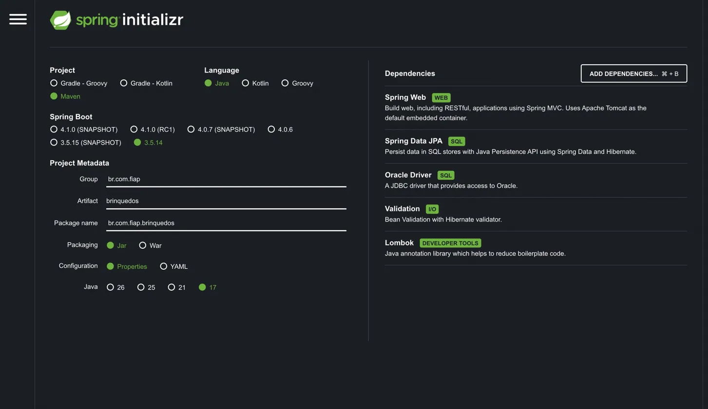
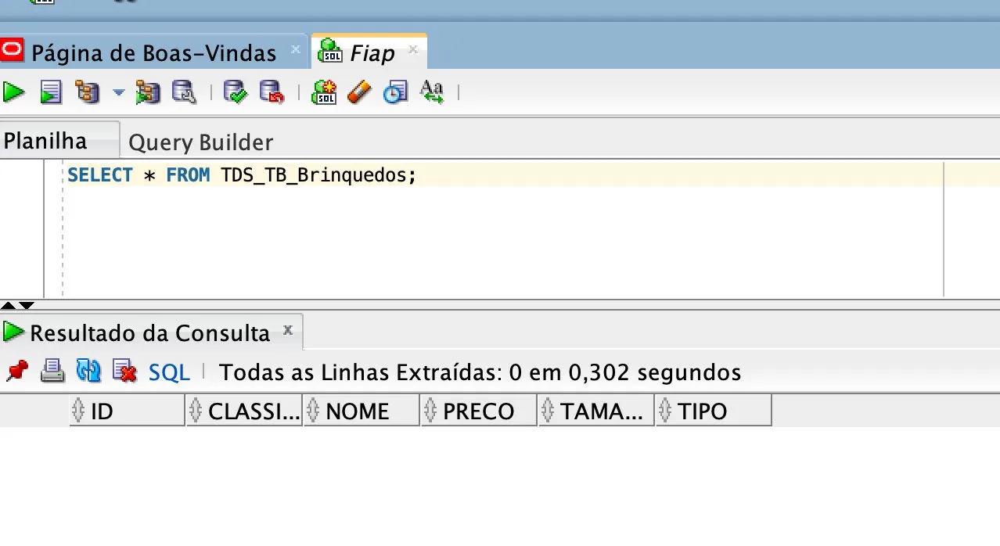
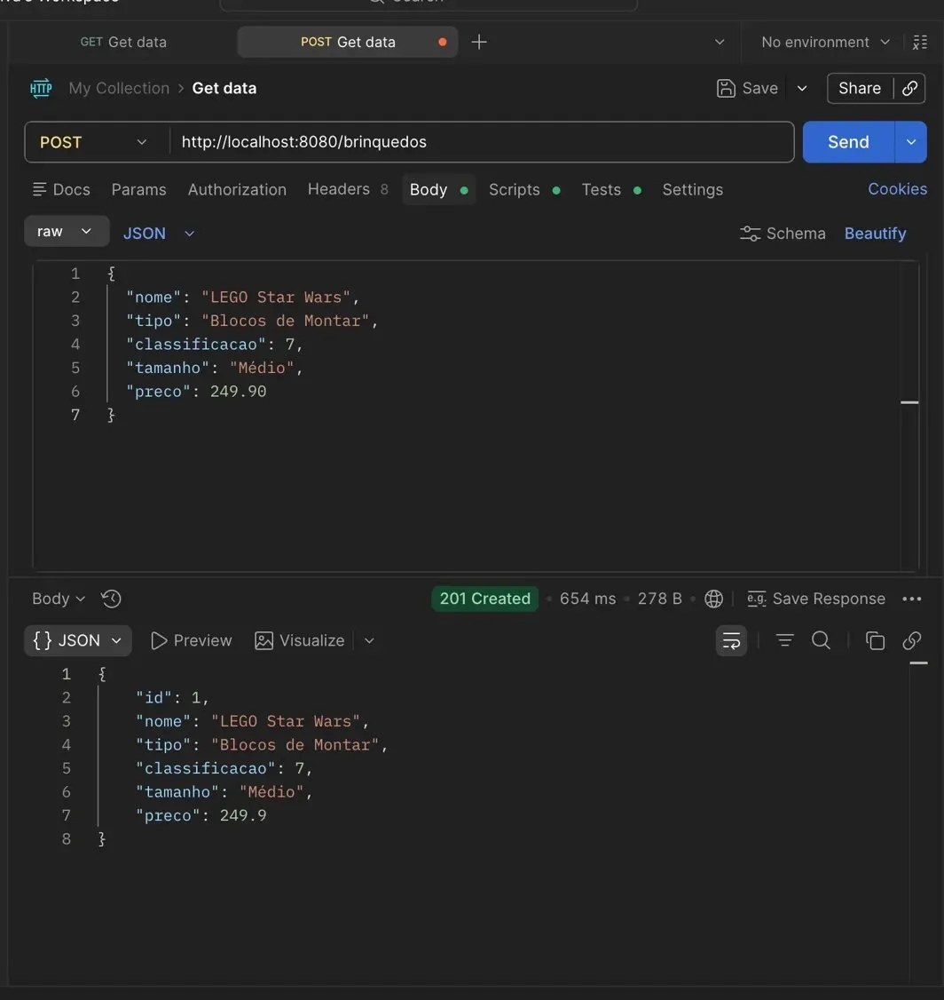
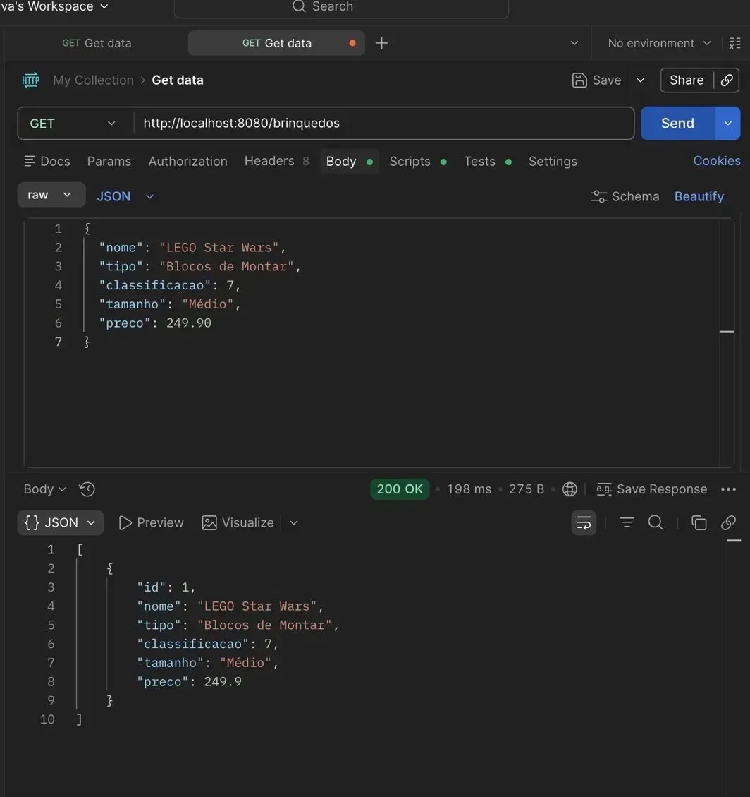
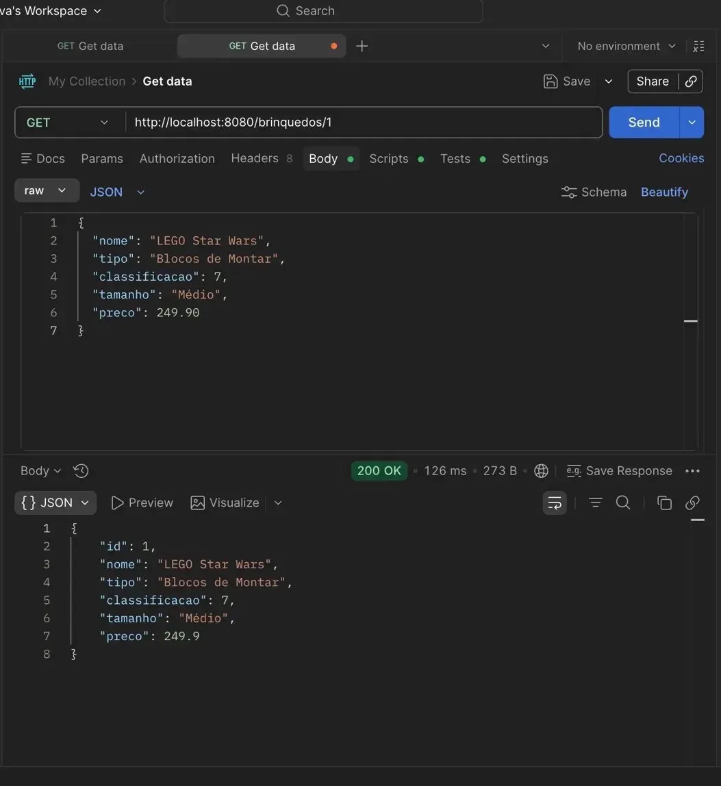
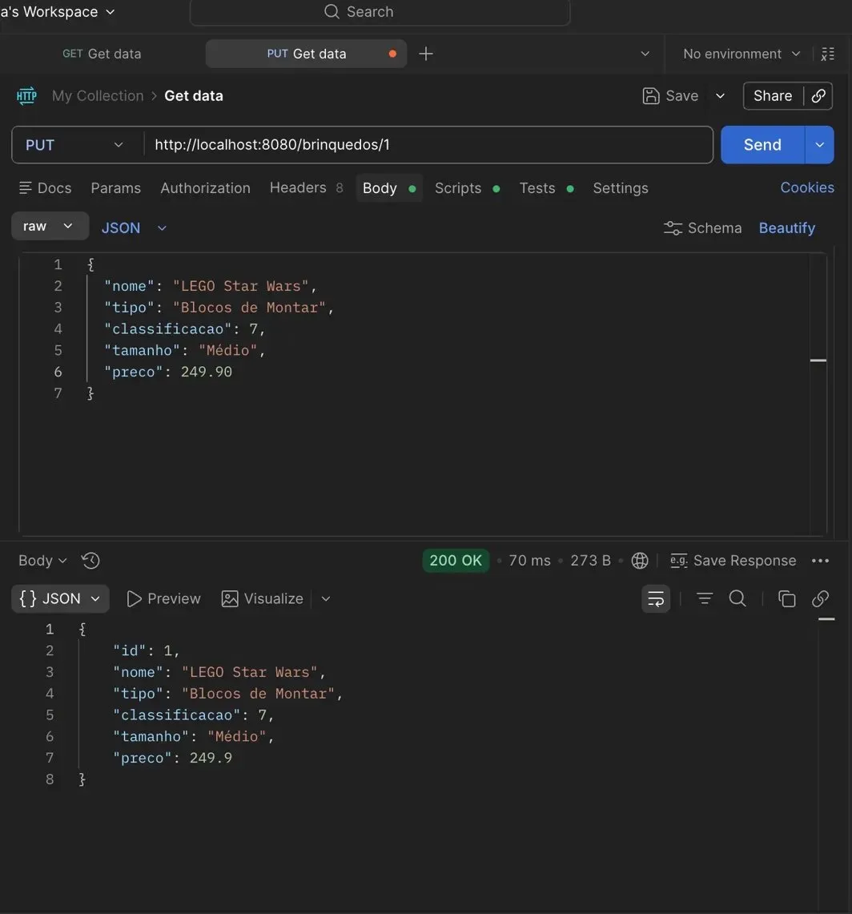
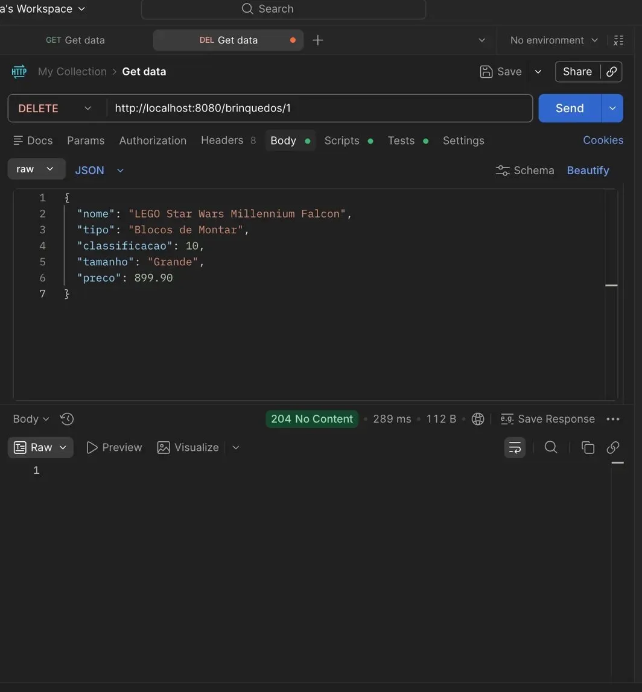

# 🧸 CP2 - API de Brinquedos | FIAP TDS

> **Checkpoint 2 — Programação Spring Boot com Persistência**
> Professor: Dr. Marcel Stefan Wagner

## 👥 Integrantes do Grupo

| Nome | RM |
|---|---|
| Erick Bernardes Bradaschia | 565733 |
| Gabriel Santos Claudino | 564054 |
| Kaiky de Oliveira Silva | 566067 |
| Lucas Fortes de Lima | 559523 |
| Jonathan Moreira Gomes | 565060 |

---

## 📋 Descrição do Projeto

API REST desenvolvida com **Spring Boot + Maven + Java 17** para gerenciar o catálogo de brinquedos de uma empresa especializada em produtos para crianças de até 14 anos. A aplicação realiza operações completas de **CRUD** via endpoints HTTP, com persistência no banco **Oracle SQL Developer** (ORACLE_FIAP), testados via **Postman**.

---

## ⚙️ Configuração do Spring Initializr

---

## 🗄️ Banco de Dados Oracle

### Tabela: TDS_TB_Brinquedos

| Coluna | Tipo | Descrição |
|---|---|---|
| ID | NUMBER | Chave primária (auto-gerada via Sequence) |
| NOME | VARCHAR2(100) | Nome do brinquedo |
| TIPO | VARCHAR2(50) | Categoria/tipo do brinquedo |
| CLASSIFICACAO | NUMBER | Idade mínima recomendada (0–14) |
| TAMANHO | VARCHAR2(20) | Tamanho |
| PRECO | NUMBER | Preço em reais |

### Consulta no SQL Developer

> A tabela aparece vazia pois o DELETE foi executado com sucesso, confirmando que a exclusão no banco funcionou corretamente.

---

## 🔗 Endpoints da API

| Método | Endpoint | Descrição |
|---|---|---|
| POST | /brinquedos | Cadastrar novo brinquedo |
| GET | /brinquedos | Listar todos |
| GET | /brinquedos/{id} | Buscar por ID |
| PUT | /brinquedos/{id} | Atualizar |
| DELETE | /brinquedos/{id} | Excluir por ID |

---

## 🧪 Testes no Postman

### ✅ POST — 201 Created

> Brinquedo cadastrado com sucesso. ID gerado automaticamente pela sequence do Oracle.

### 📋 GET Todos — 200 OK

> Lista retornada com todos os brinquedos cadastrados no banco Oracle.

### 🔍 GET por ID — 200 OK

> Brinquedo retornado com sucesso ao consultar pelo ID específico.

### ✏️ PUT — 200 OK

> Brinquedo atualizado com sucesso no banco Oracle.

### 🗑️ DELETE — 204 No Content

> Brinquedo excluído com sucesso. Resposta vazia confirma a operação.

---

*FIAP — Faculdade de Informática e Administração Paulista*
*Curso de Tecnologia em Análise e Desenvolvimento de Sistemas (TDS)*
